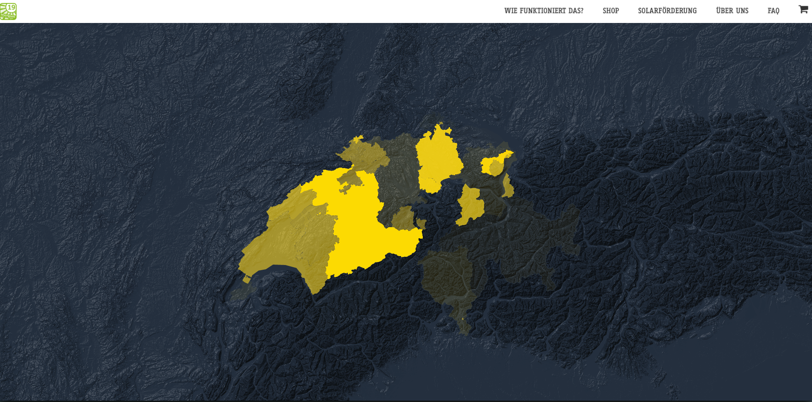

Maps Donation Overview
======================

This repository holds the code developed together with representatives of [SOLAFRICA](https://solafrica.ch/)
during the Hackathon at the RaiseNow Inspire 2019.

## Getting Started

This repository is split into dedicated parts:
* The backend component providing aggregated data for each canton
* The frontend component providing the visualization

Please refer to the `README`s of the backend component first, as its setup
is required to make the frontend work 
